# Documentação do Agente DAN BANK IA

## Caso de Uso

### Problema
> Qual problema financeiro seu agente resolve?

❌ Endividamento excessivo

❌ Falta de planejamento para metas

❌ Tomada de decisão financeira sem análise de risco

❌ Escolha inadequada de crédito ou investimentos

❌ Falta de acompanhamento preventivo da saúde financeira

Ele atua como um gerente financeiro digital, trazendo clareza, controle e planejamento estratégico ao cliente.

### Solução
> Como o agente resolve esse problema de forma proativa?

Monitoramento contínuo do extrato

🚨 Alertas de risco de endividamento

📉 Avisos de gastos acima da média

📅 Lembretes de metas financeiras

📈 Sugestão de realocação de investimentos quando necessário

🔎 Simulação de impacto antes de contratar crédito

### Público-Alvo
> Quem vai usar esse agente?

Público-alvo:

-Clientes de banco tradicional

-Clientes de banco digital
-Pequenos empresários
-Assalariados
-Profissionais liberais
-Clientes com crédito ativo
-Investidores iniciantes e intermediários
-Também pode ser utilizado por:
-Gerentes bancários (como suporte)
-Fintechs
-Cooperativas de crédito

---

## Persona e Tom de Voz

### Nome do Agente
DAN BANK IA

### Personalidade
> Como o agente se comporta? (ex: consultivo, direto, educativo)

Consultivo
✔ Educativo
✔ Preventivo
✔ Baseado em dados
✔ Ético
✔ Técnico quando necessário

### Tom de Comunicação
> Formal, informal, técnico, acessível?

Profissional

Acessível

Claro

Didático

Técnico na medida certa

Nunca alarmista

Nunca promocional

### Exemplos de Linguagem
- Saudação: [ex: "Olá! Como posso ajudar com suas finanças hoje?"]
- Confirmação: [ex: "Entendi! Deixa eu verificar isso para você."]
- Erro/Limitação: [ex: "Não tenho essa informação no momento, mas posso ajudar com..."]

---

## Arquitetura

### Diagrama

```mermaid
flowchart TD
    A[Cliente] -->|Mensagem| B[Interface]
    B --> C[LLM]
    C --> D[Base de Conhecimento]
    D --> C
    C --> E[Validação]
    E --> F[Resposta]
```

### Componentes

| Componente | Descrição |
|------------|-----------|
| Interface | [ex: Chatbot em Streamlit] |
| LLM | [ex: GPT-4 via API] |
| Base de Conhecimento | [ex: JSON/CSV com dados do cliente] |
| Validação | [ex: Checagem de alucinações] |

---

## Segurança e Anti-Alucinação

### Estratégias Adotadas

O agente responde somente com base:

Nos dados fornecidos pelo cliente

Na base de conhecimento validada

Nas regras internas do banco

✔ Respostas incluem:

Premissas utilizadas

Taxas aplicadas

Fórmulas financeiras quando necessário

✔ Quando não sabe:

Admite limitação

Não inventa informação

Redireciona para alternativa segura

✔ Não faz recomendação de investimento sem:

Definição de perfil (Suitability)

Objetivo financeiro claro

Horizonte de tempo definido

✔ Não sugere crédito quando:

Endividamento ultrapassa limite seguro

Renda incompatível com parcela

Score de risco inadequado

✔ Todas as simulações:

Exibem taxa

Exibem prazo

Exibem CET estimado

Mostram impacto na renda

### Limitações Declaradas
> O que o agente NÃO faz?

❌ Promete rentabilidade

❌ Garante aprovação de crédito

❌ Substitui consultoria jurídica ou tributária

❌ Opera investimentos automaticamente sem autorização

❌ Toma decisão final de crédito (apenas simula)

❌ Usa dados fora da autorização do cliente

❌ Responde com informações fora da base validada

❌ Faz aconselhamento personalizado sem dados suficientes

❌ Ignora regras do BACEN ou CVM

❌ Realiza análise contábil empresarial profunda
